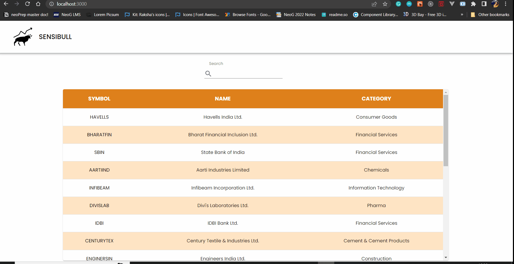

# Sensibull Frontend Assignment

Assignment solution for the position of Frontend Developer for Sensibull.

View the live website here: [https://sensibull-fe-assignment.netlify.app/](https://sensibull-fe-assignment.netlify.app/)

## Features

- Made using [Material UI](https://mui.com/)
- Uses ReactJS, CSS, JavaScript
- Fully Responsive Design
- Reusable Components

## API Reference

Stock APIs provided by Sensibull

#### Instruments API

```http
  GET https://prototype.sbulltech.com/api/v2/instruments
```

Response: CSV with list of instruments

#### Quotes API

```http
  GET https://prototype.sbulltech.com/api/v2/quotes/${symbol}
```

Response: Array of quotes for the given symbol

| Parameter | Type     | Description                       |
| :-------- | :------- | :-------------------------------- |
| `symbol`      | `string` | **Required**. Symbol of instrument to fetch respective quotes |

## Run Locally

Clone the project

```bash
  git clone https://github.com/RakshaPawar108/sensibull-fe-assignment.git
```

Go to the project directory

```bash
  cd sensibull-fe-assignment
```

Install dependencies

```bash
  npm install
  
  OR

  yarn install
```

Start the development server

```bash
  npm run start
```

Open [http://localhost:3000](http://localhost:3000) to view it in your browser.

## Demo



## About the Developer

- GitHub: [@RakshaPawar108](https://github.com/RakshaPawar108)
- Twitter: [@rakshapawar108](https://twitter.com/rakshapawar108)
- LinkedIn: [https://www.linkedin.com/in/rakshapawar/](https://www.linkedin.com/in/rakshapawar/)
- Peerlist: [https://peerlist.io/rakshapawar](https://peerlist.io/rakshapawar)
